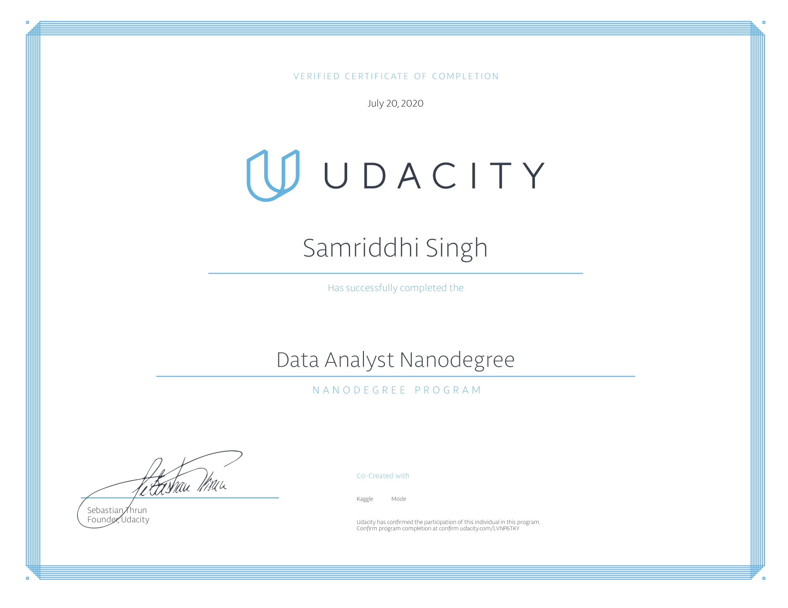

# data-analyst-nanodegree
all projects and interessting case studies
These are all udacitys projects and some case studys i found to be interessting
<h1>Projects</h1>
<ul>
<li><h2>P1 Explore Weather Trends</h2>
    In this project, I analysed local and global temperature data and compare the temperature trends where you live to overall global temperature trends.
    then I  has to extract 2 datasets using sql code and analyse them with what I was fimiliar to
<li><h2>P2 investigate a dataset</h2>
  here we put our newly python analysis skills to the test.I chose the missed doctors appoinment dataset.
<li><h2>P3 Analyze A/B Test Results</h2>
here we had a strucured task page where we had to perform a/b testing
<li><h2>P4 Wrangle and Analyze Data</h2>
This was my personal favourite.We analysed tweets from a twitter account we rate dogs.
we used 3 sources of data one was given one you had download programmaticly and one using twitters API
<li><h2>P5 Communicate Data Findings</h2>
For this Project I chose the USA flight.I did both explanetory and exploretory visuallizations and created a slide deck for the explaetory notebook
</ul>

<h1>Case Studies</h1>
<ul>
<li> <h2>wine-analysis</h2>
Here we tried ti define if we could analyse if a wine was good depending on its cemical properties
<li><h2>fuel_data_analysis</h2>
here we analyes fuel and car types.
</ul>
<strong>more infos in each Projects readme</strong> 
certeficate: 

