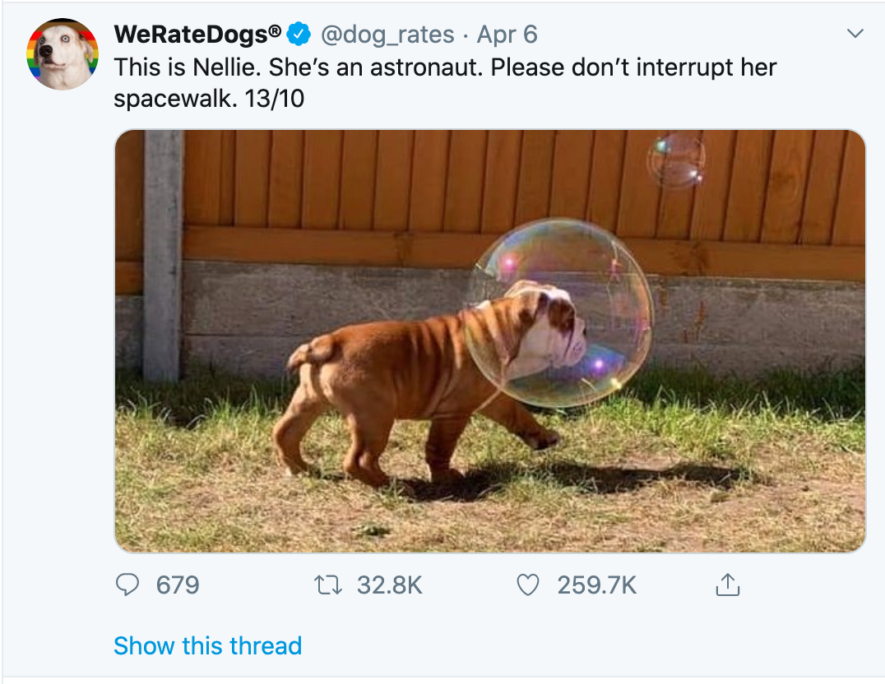

# twitter-project
 
 
the data wrangling project from the udacity data analyst nanodegree 
for this project I used <strong>tweepy</strong>(twitters API)wich has rescricted acssess.To get your API keys go [here](https://developer.twitter.com/en/docs/basics/authentication/guides/log-in-with-twitter)
(<i>devloper twitter where you have to give your resoning fot fetting those keys and what you will do with them</i>) 
This project focusess on the twitter acount [we rate dogs](https://twitter.com/dog_rates) 
and analyses about 2000 of these post as seen above 
to help understand my prossess go to the wrangle and act report. 
