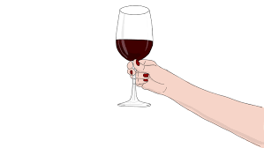

# wine-analasis
 
This was a udacity case study 
In this wine analysis, I analyzed all the chemical properties of wine to find out what gives the wine the best quality rating. 
I created this with jupyter notebook,the pandas,matplotlib,numpy and seaborn. 
